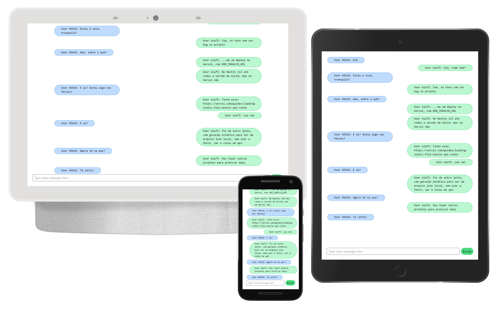

# Mini chat


Esta aplicação foi criada com [Next.js](https://nextjs.org/) e inicializado com o[`create-next-app`](https://github.com/vercel/next.js/tree/canary/packages/create-next-app).

## Inicializando

Use o comando abaixo para rodar o servidor em modo de desenvolvimento:

```bash
npm run dev
# or
yarn dev
# or
pnpm dev
```

Abra o link [http://localhost:3000](http://localhost:3000) no seu browser para ver o resultado.

## Para saber mais

O site do [Socket.IO](https://socket.io/get-started/chat#getting-this-example) possui exemplos de integração para criar um aplicativo de bate-papo básico, fornecendo um canal de comunicação bidirecional entre cliente e servidor.
